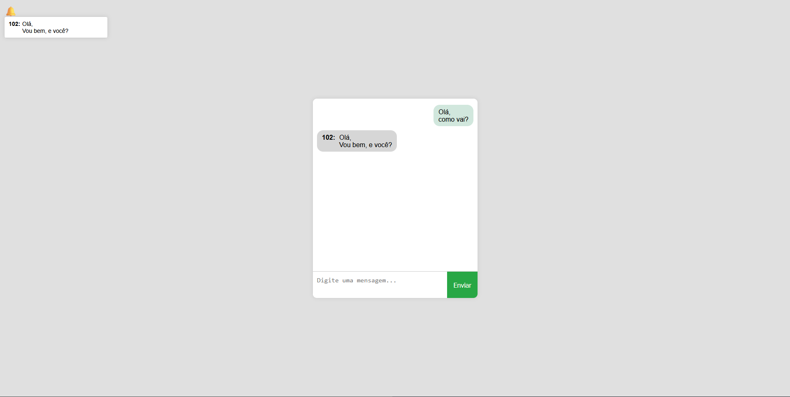

# 💬 Chat em Tempo Real com WebSocket



Um sistema simples de chat em tempo real utilizando WebSocket com PHP Ratchet no backend e JavaScript puro no frontend.

# 📋 Pré-requisitos

- PHP 8.0 ou superior
- Composer instalado
- Terminal/Command Prompt
- Navegador moderno (Chrome, Firefox ou Edge)

# 🛠️ Instalação e Configuração
Primeiro, clone o repositório:

```bash
git clone https://github.com/ViniciusFloriano/Teste-Chat-and-Notification.git
cd Teste-Chat-and-Notification
```

Instale as dependências do PHP:

```bash
composer install
```

# 🚀 Como Executar
Iniciando o Servidor WebSocket:

Abra um terminal na pasta do projeto e execute:

```bash
php chat-server.php
```

Mantenha este terminal aberto enquanto estiver usando o chat.

# Acessando o Chat

1. ### Abra o arquivo index.html em seu navegador:
- Você pode usar um servidor local como o Live Server do VS Code
- Ou acesse diretamente pelo caminho do arquivo

2. ### Para testar com múltiplos usuários:
- Abra outra aba/anônima no navegador
- Ou use um navegador diferente

# 🧩 Estrutura do Projeto
```
Teste-Chat-and-Notification/
├── chat-server.php      # Servidor WebSocket
├── index.html           # Interface do chat
├── chat.js              # Lógica do frontend
├── style.css            # Estilos principais
├── vendor/              # Dependências do Composer
└── README.md            # Este arquivo
```

# 📌 Recursos Implementados

#### ✔️ Chat em tempo real
#### ✔️ Notificações de novas mensagens
#### ✔️ Identificação visual de mensagens (enviadas/recebidas)
#### ✔️ Suporte a quebras de linha e mensagens longas
#### ✔️ Design responsivo

# 🎮 Como Usar o Chat
Ao abrir o chat, você será automaticamente atribuído a um id de usuário aleatório

Digite sua mensagem no campo de texto

Pressione Enter ou clique em "Enviar"

As mensagens aparecerão em tempo real em todas as janelas conectadas

# 🔔 Notificações:

Quando receber uma mensagem em segundo plano, um ícone de sino mostrará o número de mensagens não lidas

Clique no sino para ver as notificações

# 🐛 Solução de Problemas
### Mensagens não aparecem:
- Verifique se o servidor está rodando
- Confira o console do navegador (F12 > Console) por erros
- Recarregue a página

### Erros de conexão
Certifique-se de que:
- Você está acessando pelo mesmo domínio/porta
- Nenhum firewall está bloqueando a conexão

# 📚 Dependências
#### Ratchet - Biblioteca WebSocket para PHP
#### Composer - Gerenciador de dependências PHP
